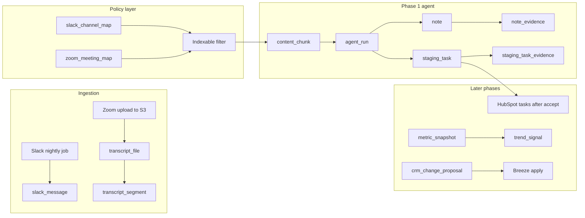

# Agent platform: database design and build strategy

## Why this shape (strategy in plain terms)

**Separate “what we captured” from “what we inferred.”** Slack lines and Zoom transcripts are facts; summaries, commitments, and tasks are interpretations. If those live in the same blob, you cannot audit mistakes, re-run models after prompts improve, or prove compliance (e.g. “we never indexed exec transcripts”). Storing **raw ingestion rows** with stable IDs and **derived rows** that reference them is the foundation for accurate retrieval and trust.

**Prove every answer.** For phase 1 accountability (“you said you’d do X”), the system needs **provenance**: which message or transcript span supported each task or note. That drives table design: `source_ref` links from staging tasks and notes back to `slack_message` / `transcript_segment` (or a unified `content_chunk` view).

**Enforce boundaries at ingest and at query.** “No exec transcripts” should be a **data property** (e.g. sensitivity on a meeting or channel mapping), not a hope that the LLM will behave. Ingest jobs or upload handlers set `sensitivity_level` / `is_indexable`; retrieval and embedding jobs **filter** on those flags so excluded content never enters the agent’s working set.

**Lambda + RDS is a good fit** for nightly/batch jobs and on-demand APIs, but plan for **connection management** (RDS Proxy or a small connection pooler) so many concurrent Lambdas do not exhaust DB connections. Accurate writes mean **idempotent upserts** (same Slack `channel_id` + `ts` or same Zoom file hash) and **clear ownership** of which job last touched a row.

**HubSpot + Breeze for writes (phase 3)** matches a sound pattern: your DB holds **proposals and approval state**; HubSpot remains the system of record for CRM mutations, with Breeze (or similar) executing approved actions. That avoids giving a general-purpose LLM direct CRM write access while still automating follow-through.

---

## Repo scope (greenfield vs this workspace)

**Nothing in this plan depends on the `gl-server` repo.** You can build the agent platform in a **new repository** with a clean layout (IaC, Lambdas, migrations). If you happen to have Slack download logic already (e.g. `gli_slack_agent/message_downloader.py` with SQLite `channel_state`, `messages`, `users`, `channel_summaries`), you may **optionally** reuse ideas or code paths—same natural keys (`channel_id` + `ts`), clearer **derived artifact** model for summaries vs raw messages—but that is **convenience, not a requirement**.

---

## Deploying Lambdas from Cursor (no Console required)

Cursor is an editor; **AWS does not ship a “Deploy Lambda” button inside Cursor itself.** What people mean by “deploy from the IDE” is: **open the integrated terminal in Cursor** and run the same commands (or scripts) you would run anywhere else, with infrastructure defined **as code in your repo**.

**Typical setup (single place to work):**

1. **Infrastructure as code** in the repo: [AWS SAM](https://docs.aws.amazon.com/serverless-application-model/), [AWS CDK](https://docs.aws.amazon.com/cdk/), Terraform, or Serverless Framework. SAM and CDK are common for Lambda + API Gateway + scheduled events.
2. **Deploy commands** from Cursor’s terminal, e.g. `sam build && sam deploy` or `cdk deploy`, after [AWS CLI](https://docs.aws.amazon.com/cli/) is configured (`aws configure` or IAM Identity Center / SSO).
3. **Optional:** [AWS Toolkit](https://aws.amazon.com/visualstudio/) for VS Code works with Cursor; it can complement CLI (e.g. browse Lambdas, invoke, some deploy flows) but **the repeatable source of truth** should still be IaC + terminal or CI.

**You do not need the AWS Management Console for day-to-day code pushes** once this is wired—only for initial account/bootstrap, debugging, or one-off console tasks.

Add to the project **early**: a short `README` section with exact deploy commands, required env vars/secrets (SSM/Secrets Manager), and stack names so “work in one place” stays true for the whole team.

---

## Database structure (Postgres on RDS)

Below is a **logical** layout (table groups). Adjust naming to taste; the relationships matter more than exact SQL.

### 1) Tenancy and clients (foundation for “ask about a client”)

| Table                | Role                                                                                                                             |
| -------------------- | -------------------------------------------------------------------------------------------------------------------------------- |
| `organization`       | Optional if multi-tenant; else single row.                                                                                       |
| `client_account`     | Your notion of “customer” (name, external refs).                                                                                 |
| `client_external_id` | Map HubSpot company/contact/deal IDs when you add them (`system` = `hubspot`, `id_type`, `value`).                               |
| `slack_channel_map`  | `channel_id` → `client_account_id`, optional `purpose`, `**sensitivity`** (e.g. `public_internal` / `restricted` / `exec_only`). |
| `zoom_meeting_map`   | Meeting series or IDs → `client_account_id`, `**sensitivity`**, `**allow_indexing`** boolean.                                    |

**Why:** Without explicit mapping, Slack channels and Zoom meetings are orphaned strings. Sensitivity on the **map** (or on each transcript upload) is how you enforce “no exec transcripts” systematically.

### 2) Raw Slack (mirror + extend current model)

| Table               | Role                                                                                                                                                                                                                                                                                                                                                         |
| ------------------- | ------------------------------------------------------------------------------------------------------------------------------------------------------------------------------------------------------------------------------------------------------------------------------------------------------------------------------------------------------------ |
| `slack_message`     | Columns aligned with today: `channel_id`, `ts`, `user_slack_id`, `text`, `client_msg_id`, `channel_name`, `user_name`, `posted_at` (derived from `ts`), `**thread_ts`** (for threading—same as `ts` for root messages in Slack), raw JSON optional (`payload_json` for audit). **Primary key:** `(channel_id, ts)` or surrogate `id` with unique constraint. |
| `slack_user`        | Slack user directory (you already have `users`).                                                                                                                                                                                                                                                                                                             |
| `slack_sync_cursor` | Replaces `channel_state`: `channel_id`, `latest_ts`, `last_success_at`, `run_id`.                                                                                                                                                                                                                                                                            |

**Why:** Nightly jobs need cursors per channel and a single place to reconcile failures. Storing optional `payload_json` helps when Slack’s text edits require re-processing.

### 3) Zoom transcripts (upload path)

| Table                | Role                                                                                                                                                                                                       |
| -------------------- | ---------------------------------------------------------------------------------------------------------------------------------------------------------------------------------------------------------- |
| `transcript_file`    | One row per upload: `storage_key` (S3), `sha256`, `uploaded_at`, `uploaded_by`, `client_account_id` (if known), `meeting_id` / `occurrence_at`, `**sensitivity`**, `**indexing_allowed`**, `parse_status`. |
| `transcript_segment` | Ordered lines: `transcript_file_id`, `segment_index`, `speaker_label`, `text`, `start_ms`, `end_ms` if available.                                                                                          |

**Why:** File-level metadata supports dedup by hash and policy (“this file is exec_only → do not embed”). Segment-level rows power citations and chunking for RAG.

### 4) Unified search chunks (optional but recommended for phase 1 RAG)

| Table           | Role                           |
| --------------- | ------------------------------ |
| `content_chunk` | `source_type` (`slack_message` |

**Why:** One retrieval path for “everything we’re allowed to see about client X” without the agent writing different SQL per source. Chunks can be rebuilt when chunking strategy changes.

**Slack-specific (on `slack_message` or denormalized onto chunks):** add `thread_ts` (Slack thread parent) and whether the row is a **thread root** vs reply, so you can slice to **one thread** or **last N days** without scanning a whole channel. Without thread boundaries, “detailed enough” filtering is weaker.

### 5) Agent outputs: notes and staging tasks (phase 1)

| Table                   | Role                                                                                                                                                                                                                                                             |
| ----------------------- | ---------------------------------------------------------------------------------------------------------------------------------------------------------------------------------------------------------------------------------------------------------------- |
| `agent_run`             | `started_at`, `trigger` (`nightly`, `manual`), `model`, `status`, `error`.                                                                                                                                                                                       |
| `note`                  | `client_account_id`, `body`, `created_at`, `agent_run_id`, `status` (`draft`/`active`/`superseded`).                                                                                                                                                             |
| `note_evidence`         | Many-to-many: `note_id` → `content_chunk_id` or raw `(source_type, source_id)`.                                                                                                                                                                                  |
| `staging_task`          | `title`, `description`, `due_at` (nullable), `assignee_user_id` (internal), `client_account_id`, `status` (`pending_review` / `accepted` / `rejected` / `exported`), `agent_run_id`, `confidence`, `**hubspot_task_payload_json`** (nullable, for later export). |
| `staging_task_evidence` | Links `staging_task_id` → `content_chunk_id` (or raw sources).                                                                                                                                                                                                   |

**Why:** Accountability requires **evidence links**. `staging_task` is your human-in-the-loop queue before anything touches HubSpot.

### 6) Phase 2: scheduled metrics and trends

| Table               | Role                                                                                                                      |
| ------------------- | ------------------------------------------------------------------------------------------------------------------------- |
| `metric_definition` | Name, query spec or API descriptor, `cadence`, owner.                                                                     |
| `metric_snapshot`   | `metric_definition_id`, `captured_at`, `value_json`, `dimensions` (e.g. client segment).                                  |
| `trend_signal`      | Output of batch analytics: `metric_snapshot_id` range, `signal_type` (e.g. discontent), `severity`, `evidence_chunk_ids`. |

**Why:** Separates **facts** (snapshots) from **interpretation** (trends), so you can re-score trends without re-fetching raw numbers if definitions are stable.

### 7) Phase 3: proposed CRM updates (HubSpot/Breeze handoff)

| Table                    | Role                                                                                                                                                      |
| ------------------------ | --------------------------------------------------------------------------------------------------------------------------------------------------------- |
| `crm_change_proposal`    | `client_account_id`, `proposal_type`, `payload_json`, `status` (`pending`/`approved`/`rejected`/`applied`), `evidence_refs`, `requested_by_agent_run_id`. |
| `crm_change_application` | When Breeze applies: `applied_at`, `external_ref`, `error`, links to `crm_change_proposal`.                                                               |

**Why:** The LLM never “writes CRM”; it **proposes**. Approval and execution stay in controlled tools.

---

## Indexing and integrity (short list)

- **Unique:** Slack `(channel_id, ts)`; transcript file `sha256` per org; chunk idempotency if you hash `(source_type, source_id, chunk_version)`.
- **FKs:** Evidence and tasks reference chunks or raw rows; `ON DELETE RESTRICT` for anything cited (prefer soft-delete on sources).
- **Query:** `(client_account_id, posted_at)` on messages/chunks; GIN on `tsvector` if using Postgres full-text; pgvector index when you add embeddings.

---

## Slicing data to keep LLM token use down

**Are the proposed tables/columns enough?** They are **sufficient as a foundation** if you treat retrieval as a **pipeline**: narrow in SQL (or metadata filters on a vector store), then optionally re-rank, then only then send text to the LLM. Token savings come from **(a)** rich **metadata** for `WHERE` clauses, **(b)** **chunking** with `token_count`, **(c)** **rolling / periodic summaries** for questions that do not need raw lines, and **(d)** **hybrid** search (keyword or time-bounded pre-filter + top-k vectors).

| Mechanism                    | What to store / do                                                                                            | Why it cuts tokens                                                                             |
| ---------------------------- | ------------------------------------------------------------------------------------------------------------- | ---------------------------------------------------------------------------------------------- |
| **Time slice**               | `posted_at`, `occurrence_at`, segment times                                                                   | Restrict to “last 7 days” or “this meeting” before any LLM call                                |
| **Client / policy slice**    | `client_account_id`, sensitivity / `indexing_allowed`                                                         | Never load disallowed or irrelevant clients                                                    |
| **Source slice**             | `channel_id`, `transcript_file_id`, `source_type`                                                             | “Only #customer-foo” or “only this Zoom file”                                                  |
| **Thread slice (Slack)**     | `thread_ts` on `slack_message`                                                                                | Fetch one thread instead of full channel history                                               |
| **Chunk boundaries**         | `content_chunk` with `chunk_index`, `token_count`, `chunk_version`                                            | Fixed-size retrieval units; rechunk without losing lineage                                     |
| **SQL or FTS prefilter**     | `tsvector` on chunk text (or keywords)                                                                        | Reduce candidate set before embeddings or LLM                                                  |
| **Vector + metadata**        | Same row: embedding + `client_account_id` + date                                                              | **Filtered** ANN search—not “whole corpus” top-k                                               |
| **Summaries (strong lever)** | Table e.g. `client_period_summary` (`client_account_id`, `period_start`, `period_end`, `body`, `source_kind`) | Answer overview questions from **hundreds** of tokens instead of **thousands** of raw messages |

**What is not solved by schema alone:** max token **budgets**, **re-ranking**, and **“map → reduce”** (summarize each chunk then merge) live in **application logic**. The schema should expose the **dimensions** those layers need; adding `**thread_ts`** and `**token_count` / `chunk_version`** on chunks closes the biggest gaps in the original sketch.

**Optional later:** tags (`topic`, `sentiment_score` from batch jobs) on `content_chunk` for finer slicing—only add when you have a clear use case to avoid noisy labels.

---

## End-to-end flow (conceptual)

---

## Build order (matches your “accurate data first”)

1. **Repo + IaC skeleton** (SAM or CDK): Lambda placeholders, RDS/Proxy wiring, deploy from Cursor terminal documented; optional GitHub Actions later.
2. **RDS schema + migrations** for raw Slack + sync cursors + transcript file/segment + client maps + sensitivity flags.
3. **Ingest jobs** (Lambda): nightly Slack → Postgres idempotent upserts (reuse prototype code only if helpful); Zoom parser from S3 → `transcript_segment`.
4. **Read APIs** (or SQL views) that return **only indexable** content per client.
5. **Then** add `agent_run`, `note`, `staging_task` + evidence tables; **v1 review via CLI and/or Google Sheet** (no web GUI yet).
6. **Later:** `metric_*` tables and schedulers; then `crm_change_proposal` + HubSpot/Breeze integration; web UI when needed.

---

## Practical notes for Lambda + RDS

- Use **RDS Proxy** (or similar) to avoid connection storms.
- Prefer **batch inserts** for transcript segments; **single-row upserts** for Slack messages.
- Store **large raw payloads** (full Slack API JSON, original transcript text file) in **S3** with pointers in RDS if row size grows.

---

## Team alignment (captured decisions)

### Access control (roadmap)

- **Near term:** You will **prevent exec-only content from being ingested** (no row in DB / no chunks / no embeddings for those sources). That is the strongest guarantee.
- **Planned:** First users may be exec, but you will add **broader role-based access** later. Design the schema **now** with `sensitivity` / `indexing_allowed` on maps and transcripts, and reserve space for a future **app user + role** model (or Postgres **row-level security**) so you do not retrofit everything. Add an **audit log** table when non-exec users arrive (who queried what client).
- **Why not “just filter in the app”?** App-only checks are easy to bypass with a second client or raw SQL; DB-enforced rules or at least a single retrieval API with tests is safer long term.

### Retention: is “keep all messages” bad practice?

- **Not automatically.** For an **internal** tool ingesting **allowed** Slack channels, **keeping full history** is normal for search, accountability, and re-running embeddings after prompt changes.
- **Reasons to trim or not store:** legal/regulatory limits, customer PII in unexpected places, cost at very large scale, or explicit policy **data minimization**. Those are org/policy drivers, not a rule that retention is “wrong.”
- **Practical pattern:** Ingest only **mapped, non-exec** channels; keep raw rows for those; add **retention jobs** later if legal asks for deletion timelines.

### UX and operations (v1)

- **No web GUI at first:** interaction via **CLI** (prompt loop calling the retrieval + LLM stack).
- **Google Sheet** as the early **operational source of truth**: e.g. channel → client mapping, optional list of domains/contacts, or exporting **staging_task** rows for review. Sync via **Sheets API** (Lambda + service account) or manual CSV import until HubSpot is wired.

### Clients vs contacts; internal email domains

- **Modeling:** Prefer `**client_account`** (company) as the anchor; add `**contact`** (person) with FK when you integrate HubSpot—exact split can evolve.
- **Internal vs client:** Treat emails whose domain is in an allowlist as **internal** (your team), not customers. Initial domains to configure: `gymlaunch.com`, `gymlaunchsecrets.com`, `gymowners.com` (extend as needed). Use this for attribution (“who said it” / “customer vs us”) in prompts and tasks.

### Lambda configuration

- **Non-secret config** (feature flags, **internal domain list**, Google Sheet ID, stage name): **environment variables** on Lambda are fine.
- **Secrets** (Slack bot token, DB password, LLM API keys, **Google service account private key**): prefer **AWS Secrets Manager** or **SSM Parameter Store (SecureString)** over plaintext env vars—rotation and auditing are easier. If you start with env for speed, plan a quick move to Secrets Manager before widening access.

---

## Before we move forward (DB basics, prompts → queries)

### A) Product and policy (decide once, write down)

- **Who is the user** and **what must they never see**—drives row-level patterns and `sensitivity` / `indexing_allowed`.
- **Retention:** how long raw Slack/transcripts live; whether summaries can outlive raw data.
- **Staging workflow:** v1 **CLI / Sheet**; later GUI.
- **Secrets:** prefer Secrets Manager / SSM, not git.

### B) Database planning (minimal)

Entities, foreign keys, migrations, indexes on real filter paths—see table layout above.

### C) Querying safely (parameterized queries)

User input and LLM output must **never** be concatenated into SQL strings. Use placeholders and bound values.

### D) Prompts → parameters (not SQL)

LLM emits **JSON filters** (client, dates, intent); your code validates and runs **fixed, parameterized** queries or vector search. Optional: tool-calling with a small set of allowed operations.

### E) Next step

One-page **retrieval contract** (allowed filters, max date span, max chunks) + **access roadmap** doc.

---

This yields a **governed**, **auditable** datastore that supports phased autonomy without sacrificing CRM safety—whether you start from scratch or borrow patterns from an existing Slack downloader.